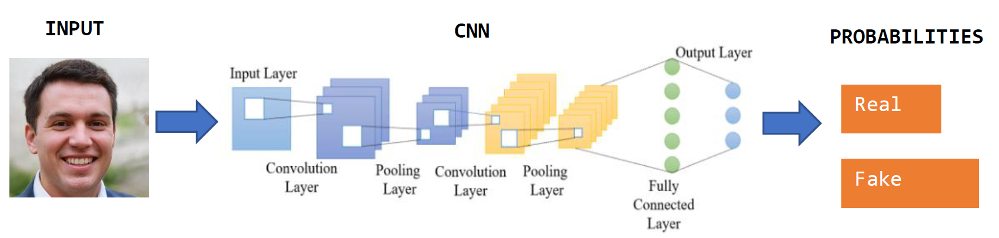
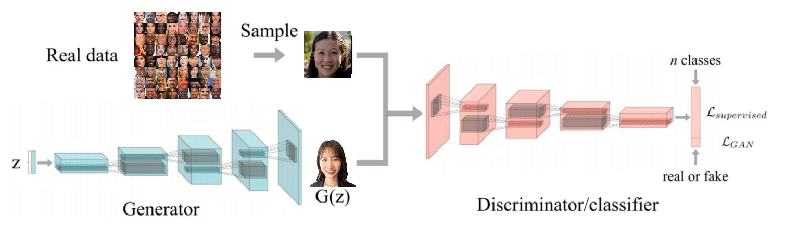
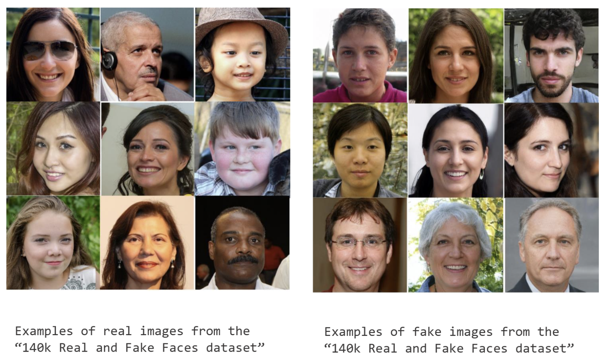
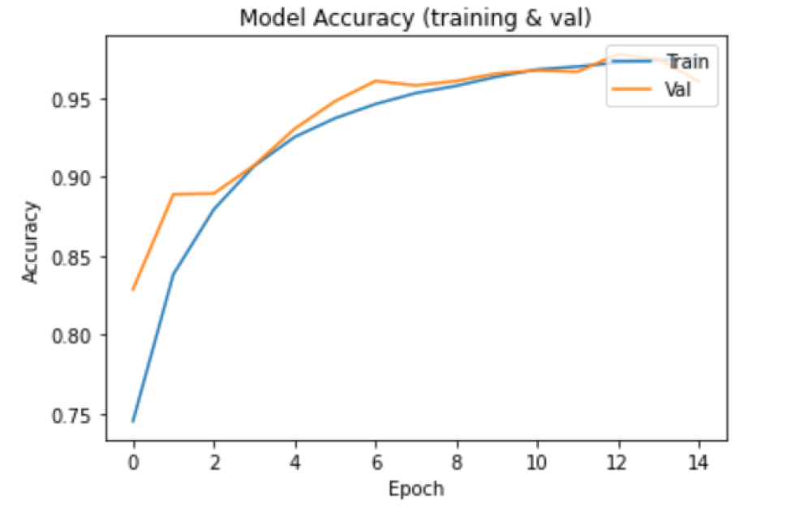
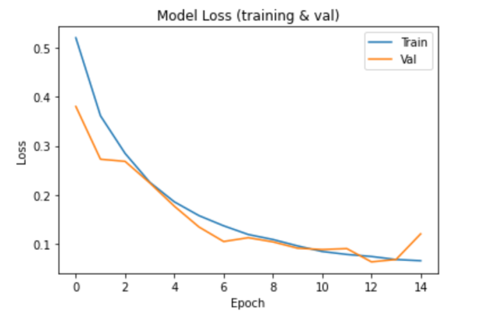

# Real vs Fake faces DCGAN

## 📌 Ideas behind our project
Our project is articulated in three main components:

1. **Convolutional Neural Network (CNN)** – used to solve the binary classification task.  
2. **Deep Convolutional Generative Adversarial Network (DCGAN)** – used to produce some examples to validate the CNN model on additional unseen data.  
3. **Real-time System** – detects face images from a video and, for each frame, uses the CNN model to classify the identified face.

---

## 🧠 What is a CNN?
A **Convolutional Neural Network (CNN)** is a deep learning neural network designed for processing structured arrays of data such as images.  

CNNs are widely used in computer vision and have become the **state of the art** for many visual applications such as **image classification**.  

They are very effective at picking up patterns in the input image, such as:  
- Lines  
- Gradients  
- Circles  
- Eyes and faces  

It is this property that makes CNNs so powerful for computer vision.  

Other important properties of CNNs are still being explored in the project. 🚀

### 🔎 Other important properties of CNNs
- **Translation invariance**: the ability to ignore positional shifts of the target in the image.  
  *Example: a cat is still a cat regardless of whether it appears in the top or bottom half of the image.*  

- **Translation equivariance**: for a CNN the position of the object in the image should not be fixed in order to be detected.  
  *Example: a cat is still recognized as a cat even if we change its color and then its position (or vice versa). In short, if the input changes, the output also changes.*



## 🧩 Deep Convolutional Generative Adversarial Network (DCGAN)

A **Deep Convolutional Generative Adversarial Network (DCGAN)** is basically a GAN architecture that uses convolutions.  
GANs are composed of two main networks called **discriminator** and **generator**, which try to improve each other.  

In the case of DCGANs, instead of simple two-layer feed-forward networks, both generator and discriminator are implemented as **convolutional neural networks**:  

- **Generator**: takes random noise in the latent vector and maps it to the data space.  
  If we are using RGB images, this means creating an RGB image.  
  It starts with a dense/fully connected layer, followed by **transpose convolution** and the **Leaky ReLU activation function**.  

- **Discriminator**: a binary classification network that takes both real and fake images and outputs a probability of whether the given image is real or fake.



Creating a real time system is a way to further asses the classification model robustness: the real and fake images are not always presented in a constrained environment but should be extracted from frames. The first operation that the system does is the extraction of the face image from the video frames, then the portion of frame in which the face was located is cropped and resized to have the same dimension of the images used to train the model. Finally, the image is ready to be classified by the model.

## 📂 Dataset: 140k Real and Fake Faces

We decided to use the Kaggle dataset called **"140k Real and Fake Faces"**.  
👉 [Link to dataset](https://www.kaggle.com/datasets/xhlulu/140k-real-and-fake-faces)  

This dataset consists of:  
- **70k REAL faces** from the Flickr dataset collected by Nvidia  
- **70k FAKE faces** sampled from the 1M fake faces generated by StyleGAN (provided by Bojan)  

The data are split into three groups:  
- **Train set**: 100,000 images  
- **Test set**: 20,000 images  
- **Validation set**: 20,000 images  

All images were initially resized to **256x256 pixels**.  
⚠️ The dataset requires at least **4 GB of storage space**, so you need to download the full dataset from Kaggle to run the code.



## 🏋️ Training and Testing of the Binary Classification Model

After scaling and shuffling the data, we built the **binary classification model** (distinguishing fake vs real faces) and trained it on the training set.  

The model was implemented using **Keras** as a sequential network with:  
- **3 convolutional layers** generating 64, 128, and 64 feature maps, with kernel sizes 3x3, 5x5, and 3x3  
- **Batch normalization, max pooling, and dropout layers** after each convolutional layer to reduce overfitting and improve generalization  
- **Flatten layer** followed by two dense layers (with batch normalization + dropout)  
- **Final dense layer** with 2 nodes activated by **Softmax**, returning probabilities for *fake* and *real* classes  

📊 **Model size**: 1,666,882 parameters (1,666,114 trainable).  
⏳ Training: 15 epochs, requiring several hours.  

After training, the model was tested on the unseen **test set**.  
- Accuracy improved steadily across epochs, with **training and test accuracy values very close**, showing minimal overfitting.  
- Loss values also decreased consistently, often lower on the test set than on the training set.  

Below are the plots of **accuracy variation** and **loss variation** during training and testing:

  


## 🏗️ Deep Convolutional Generative Adversarial Network (DCGAN) – Detailed Architecture

The goal was to create a **DCGAN** using a **discriminator** identical to our CNN binary classification model, except the last dense layer has only 1 node (to output the probability of the "real" class). The **generator** operates inversely:  

- Starts with a **dense layer**, followed by **4 Convolutional2DTranspose layers** (kernel 4x4, stride 2).  
- **Transposed convolution** (aka deconvolution) upsamples the feature map to match the spatial size of the input.  
- **LeakyReLU** is used after each transposed convolution to prevent the dying ReLU problem.  

The generator’s purpose is to **reconstruct fake images** as realistic as possible, of the same size as the original images fed to the discriminator (we used validation set images not used in previous steps). 

## 🎥 Real-Time Classification of Face Images

We tested our **binary classification model** on face images captured in real time using our laptop's front camera.  

Since the model was trained on close-up, centrally positioned faces, we used a **pre-trained OpenCV cascade classifier**:  
```python
cv2.CascadeClassifier(cv2.data.haarcascades + "haarcascade_frontalface_default.xml")
```

## Authors
- [@Pnlalessio](https://github.com/Pnlalessio)  
- [@JessicaFrabotta](https://github.com/JessicaFrabotta)
